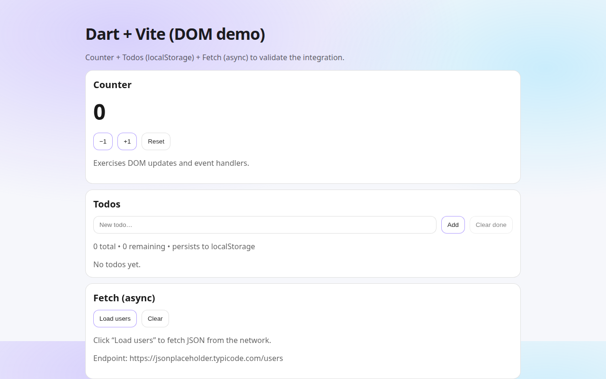

# Dart + Vite + Dart SDK (vite-plugin-dart)

Minimal Vite project that imports `.dart` directly via `vite-plugin-dart`, with a small UI written in Dart (plain DOM) to validate compilation + runtime behavior.

Live demo: https://tritao.github.io/vite-dart-dom-demo/



## URL State

- Enable debug logs: add `?debug=1`
- Show/hide users section: `?showUsers=1` / `?showUsers=0`
- Users endpoint: `?users=all` / `?users=limited`

## Prerequisites

- Node.js `^20.19.0 || >=22.12.0` (required by latest Vite)
- Linux x64 (for the included Dart provisioning script), or install Dart yourself

## Provision Dart (Linux x64)

If you don't have `dart` installed, provision Dart SDK 3.10.7 locally into `.dart-sdk/` (Linux/macOS):

```bash
npm run provision:dart
```

## Install

```bash
npm install
```

## Run

```bash
npm run dev
```

Open the URL Vite prints and you should see the demo UI rendered from `src/main.dart`.

## Troubleshooting

- `npm run dev` says `dart: not found`: run `npm run provision:dart` (Linux x64) or install Dart; you can also set `DART=/path/to/dart`.
- Vite warns about Node version: upgrade Node to `^20.19.0 || >=22.12.0`.

## Demo UI

The demo app is plain DOM (no framework) using `package:web` and includes:

- Counter (state + re-render)
- Todos (CRUD + `localStorage`)
- Fetch (async network call + loading/error states)

## Files

- `vite.config.mjs`: configures `vite-plugin-dart` and discovers the Dart binary
- `src/main.js`: Vite entry that imports `src/main.dart`
- `src/main.dart`: demo app
- `scripts/provision-dart.sh`: downloads/unzips the Dart SDK into `.dart-sdk/`
